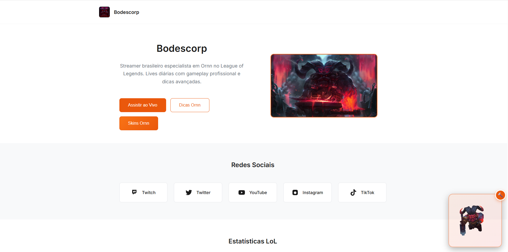
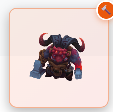
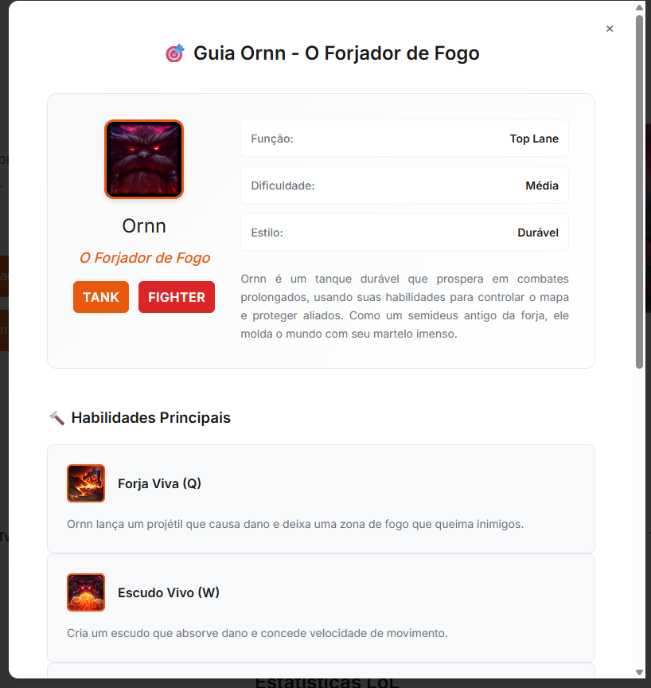
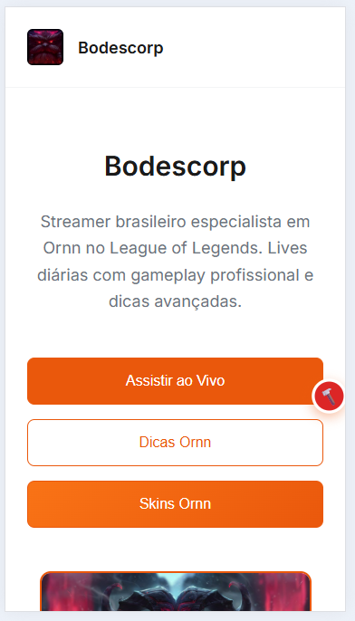

# Bodescorp Stream

**Landing page profissional para streamers de League of Legends**

---

## Galeria

*Interface principal da landing page*

*Widget 3D do Ornn em ação*

*Showcase das habilidades do campeão*

*Experiência perfeita em todos os dispositivos*

## O Problema

Streamers e criadores de conteúdo precisam de uma presença online profissional que consolide seus canais em um único lugar. Links espalhados em várias plataformas dificultam o engajamento da audiência e prejudicam a construção de marca.

**A maioria dos streamers não tem uma página dedicada.** Bio de Twitter com links não é suficiente. Linktree é genérico demais. Criar um site do zero é complexo e caro.

Este projeto resolve esse problema: uma landing page pronta para streamers de League of Legends que mostra seu domínio do campeão favorito de forma visual e profissional.

---

## Como Funciona

### Widget 3D Interativo

Modelo tridimensional do campeão que seus visitantes podem explorar livremente.

- **Rotação 360°**: Arraste com o mouse para ver todos os ângulos
- **21 animações reais**: Todas as animações do jogo (combate, habilidades, danças)
- **Visualização em tempo real**: Funciona direto no navegador
- **Sem instalação**: Não precisa baixar nada

### Informações Completas do Campeão

Informações sempre atualizadas direto dos servidores da Riot Games:

- **Biografia** completa e história do campeão
- **Estatísticas** de combate (vida, dano, defesa, velocidade)
- **Habilidades** com descrições detalhadas
- **Artes oficiais** em alta qualidade

### Centralização de Links

Direcione sua audiência para todos os seus canais:

- Twitch, YouTube, Twitter, Discord
- Design clean e direto ao ponto
- Botões destacados com calls-to-action
- Aumente seguidores e engajamento

### Design Responsivo

Experiência perfeita em qualquer tela:

- Desktop: Layout completo com todos os recursos
- Mobile: Interface adaptada e otimizada
- Tablet: Visualização intermediária balanceada

---

## Sobre o Projeto

### Criado Para o Streamer bodescorp

Esta landing page foi desenvolvida para **bodescorp**, streamer brasileiro especialista em Ornn no League of Legends. O objetivo é consolidar sua presença online e facilitar o acesso da audiência a todos os seus canais.

**Acesse a página ao vivo:**
- [bodescorp Stream](https://alttabcorp.github.io/bodescorp_stream/)

### Modelos 3D

Os modelos 3D com animações foram obtidos através do [Model Viewer](https://modelviewer.lol/), plataforma com personagens completos de League of Legends.

---

## Casos de Uso

### Para Streamers
- Consolide todos os seus links sociais em uma página
- Mostre seu domínio do personagem principal
- Direcione tráfego das redes sociais para seus canais
- Construa presença online profissional

### Para Criadores de Conteúdo
- Compartilhe uma única URL nas suas descrições
- Aumente descoberta de todos os seus canais
- Demonstre especialização visual
- Facilite engajamento da audiência

### Para One-Tricks
- Destaque sua dedicação ao campeão
- Crie identidade visual forte
- Compartilhe com a comunidade do personagem
- Atraia audiência específica

---

## Personalização

Quer criar sua própria landing page para seu campeão favorito?

📚 **Guia completo de personalização**: [customization-guide.md](docs/customization-guide.md)

O guia inclui instruções detalhadas para:
- Trocar o campeão
- Atualizar seus links sociais
- Customizar cores e visual
- Adicionar seu próprio conteúdo

---

## Compatibilidade

Funciona perfeitamente em:
- Qualquer navegador moderno (Chrome, Firefox, Edge, Safari)
- Desktop, tablet e mobile
- Todos os sistemas operacionais

---

## Créditos

**Streamer**: [bodescorp](https://alttabcorp.github.io/bodescorp_stream/)  
**Modelos 3D**: [Model Viewer](https://modelviewer.lol/)  
**Dados**: Riot Games API

---

[**Alttabcorp**](https://www.alttabcorp.com.br/) © 2025
